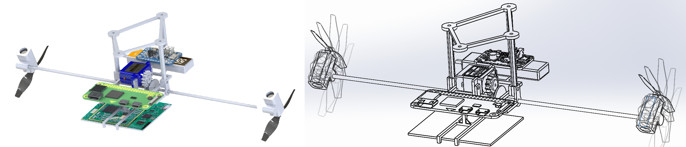

# blimp_snn

{Repo under construction... Will be fully ready soon (: }

### *Evolved neuromorphic radar-based altitude controller for an autonomous open-source blimp* **official repository**

* Supporting paper: [https://arxiv.org/abs/2110.00646](https://arxiv.org/abs/2110.00646)

In this work, we propose an evolved altitude controller based on a SNN for a robotic airship which relies solely on the sensory feedback 
provided by an airborne radar. Starting from the design of a lightweight, low-cost, open-source airship, we also present a SNN-based 
controller architecture, an evolutionary framework for training the network in a simulated environment, and a control scheme for 
ameliorating the gap with reality. The system's performance is evaluated through real-world experiments, demonstrating the advantages 
of our approach by comparing it with an artificial neural network and a linear controller. The results show an accurate tracking of the 
altitude command with an efficient control effort.


### Installation

* On the **computer**:
  1. Configure repo:
     ```shell
     cd setup
     chmod +x radar_mine_install.sh
     sudo ./radar_mine_install.sh
     ```
     Make sure after this that you have the same folder configuration for *catkin_ws* as the one shown [here](#content-and-folder-structure)
  2. Create a conda environment with Python 2.7:
     ```shell
     conda create -n myenv python=2.7
     ```
  3. Finally, install [*PyTorch 1.4.0*](https://varhowto.com/install-pytorch-1-4-0/), [*OpenCV*](https://linuxize.com/post/how-to-install-opencv-on-ubuntu-18-04/), [*PySNN*](https://github.com/BasBuller/PySNN), [*DEAP*](https://deap.readthedocs.io/en/master/installation.html), *matplotlib*, and more, as needed.


* On the **Raspberry Pi**:
  1. Install CMake, OpenCV 4.1.2 and ROS Kinetic:
     ```shell
     cd setup
     chmod +x cmake_installation.sh
     sudo ./cmake_installation.sh
     chmod +x opencv_installation.sh
     sudo ./opencv_installation.sh
     chmod +x ros_kinetic_install.sh
     sudo ros_kinetic_install.sh
     ```
  2. Configure repo:
     ```shell
     cd setup
     chmod +x radar_mine_install.sh
     sudo ./radar_mine_install.sh
     ```
  4. Install [PyTorch](https://gist.github.com/akaanirban/621e63237e63bb169126b537d7a1d979), *matplotlib*, and more, as needed.


### Content and Folder Structure

```
.
├── media                                   # Media for this repo
├── misc                                    # Irrelevant now: some first tests to move the actuators
│
├── read_me                                 # Important READMEs!
│   ├── radar_wp                                 # Radar processing algorithm: full explanation
│   ├── ros_cheat_sheet                          # ROS cheatsheet
│   └── ros_multiple_machines                    # Launching ROS both from computer and Raspberry Pi
│
├── ros_radar_mine                          # Where EVERYTHING is DONE
│   │
│   ├── catkin_ws                           # ROS MAIN WORKSPACE !!!
│   │   └── src
│   │       ├── catkin_simple                    # Package to simplify ROS builds (downloaded)
│   │       ├── mocap_optitrack                  # Package to record from the OptiTrack Motion Capture System
│   │       ├── motor_control                    # Package to control the airship (PID,ANN,SNN) and actuators
│   │       ├── plotjuggler_msgs                 # Package for real-time plotting (downloaded)
│   │       └── plotjuggler-ros-plugins          # Package for real-time plotting (downloaded)
│   │
│   ├── neuro_learning                       # EVOLUTIONARY ENVIRONMENT TO TRAIN ANNs and SNNs !!!
│   │   └── controller
│   │       ├── blimp_model                      # Folder containing mathematical model of blimp
│   │       ├── config                           # Config YAML files to set configuration for training
│   │       ├── evol_algo                        # Evolutionary algorithms used
│   │       ├── evol_funcs                       # Evolutionary functions (for initialization, mutation, etc.)
│   │       ├── evol_main                        # Evolutionary main file
│   │       ├── extra                            # Additional funcitons for plotting, etc.
│   │       ├── network                          # Definition of several types of ANN and SNN networks
│   │       ├── pid                              # Definition of PID controller
│   │       ├── save                             # Where the trained networks are saved
│   │       └── testing                          # For plotting and testing
│   │
│   ├── radar_filters                       # Irrelevant now: some files to test several radar MA filters
│   │
│   └── system_ident                        # Blimp model identification with Matlab
│
├── setup                                   # SETUP / INSTALLATION FILES !!!
│   ├── cmake_installation.sh                           # CMake installation on RPi
│   ├── opencv_installation.sh                          # OopenCV installation on RPi
│   ├── radar_mine_install_basics.sh
│   ├── radar_mine_install.sh                           # MAIN INSTALLATION FILE: EXECUTE FOR PROPER REPO CONFIG!
│   ├── radar_position2go_install.sh
│   ├── ros_kinetic_install.sh                          # ROS Kinetic installation on RPi
│   └── wpa_supplicant.conf                             # To setup default Wi-Fi connections for the RPi
│
└── SolidWorks.zip                          # SolidWorks and 3D printing files to replicate the gondola


```

### Summary




For more technical details on the electronic components, their properties and interconnection, please visit
the following link to [@marina-go-al](https://github.com/marina-go-al) 's master's thesis: [*link to be added here*]

### Citation
```
@misc{gonzalezalvarez2021evolved,
      title={Evolved neuromorphic radar-based altitude controller for an autonomous open-source blimp}, 
      author={Marina González-Álvarez and Julien Dupeyroux and Federico Corradi and Guido de Croon},
      year={2021},
      eprint={2110.00646},
      archivePrefix={arXiv},
      primaryClass={cs.RO}
}
```

### Contact

GitHub: [@marina-go-al](https://github.com/marina-go-al), [@JuSquare](https://github.com/JuSquare)

LinkedIn: [@mgonzalezalvar](https://www.linkedin.com/in/mgonzalezalvar/), [@julien-dupeyroux](https://www.linkedin.com/in/julien-dupeyroux-12a66a8a/)