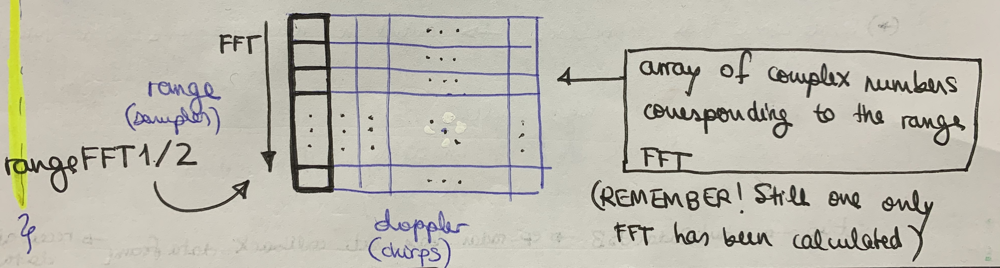

# Radar position2go ROS code explanation: SUMMARY

The project has four different packages:
* [radar_msgs](#radar_msgs-first-custom-message-package---raw-radar-message): raw radar message
* [radar_targets_msgs](#radar_msgs-second-custom-message-package---processed-radar-message): processed radar message
* [radar_ros_driver](#radar_ros_driver-publisher-for-raw-and-processed-radar-messages): publisher (of both messages)
    * [ofxRadar24Ghz.cpp](#ofxradar24ghzcpp-detailed-code-explanation)
* [radar_server](#radar_ros_server-recorder-write-messages-from-radar_ros_driver-to-files): subscriber
* [plotjuggler](#plotjuggler-real-time-plotting): real-time plotting

Here each of them will be explained in detail

## radar_msgs: first custom message package -> RAW RADAR MESSAGE

Where the *radar_msgs/Event.msg* message files are generated:
```
# A RADAR event
uint32 dimx                 # Number of chirps           (16) [*ofxRadar24Ghz.h*]
uint32 dimy                 # Number of samples per chip (64) [*ofxRadar24Ghz.h*]
float32[2048] data_rx1_re   # Number of chirps * Number of samples per chip * 2 antennas
float32[2048] data_rx1_im   # ?
float32[2048] data_rx2_re   # ?
float32[2048] data_rx2_im   # ?
time ts                     #
```

## radar_msgs: second custom message package -> PROCESSED RADAR MESSAGE

Where the *radar_targets_msgs/Event.msg* message files are generated:
```
# A RADAR TARGET event
uint32 num_current_targets      #
uint32[256] is_associated       # 256 is the range FFT size
float32[256] angle              #
float32[256] speed              #
float32[256] range              #
float32[256] strength           #
float32[256] rx1_angle_arg_re   # 
float32[256] rx1_angle_arg_im   # 
float32[256] rx2_angle_arg_re   # 
float32[256] rx2_angle_arg_im   # 
time ts                         #
```

## radar_ros_driver: PUBLISHER (for raw and processed radar messages)

Where the *radar_msgs/Event.msg* and *radar_targets_msgs/Event.msg* are PUBLISHED

The important files from this package are: *driver.h/cpp*, *ofxRadar24Ghz.h/cpp* (and *Hungarian.h/cpp*):

* *ofxRadar24Ghz.h/cpp*:
```
ofxRadar24Ghz.h: important parameters (lines 217 - 303)

void ofxRadar24Ghz::setup() {
    1) Memory allocation
    2) Kalman Filter matrices initialization [!!]
    3) Tracking algorithm settings
}

void ofxRadar24Ghz::update() { [line 342]

    * RANGE PROCESSING: FAST TIME

    1) Get raw data [line 345]
    2) Mean removal across range for RX1 and RX2 [line 443]
    3) Calculate range FFT (zero-padding + windowing) [line 502]
    4) Range target detection [line 548]

    * DOPPLER PROCESSING: SLOW TIME

    1) Mean removal across Doppler direction [line 612]
    2) Calculate Doppler FFT (windowing + FFT: filling range-Doppler map) [line 661]
    3) Extraction of indexes from range-Doppler map [line 728]
    4) Measurements computation and update! [line 767]
}
```

* *driver.h/cpp* + *driver_node.cpp*: ROS node for publishing
```
driver.h/cpp: define the namespace and class for publishing

    namespace: radar_ros_driver
    class: RadarRosDriver -> initialize ofxRadar24Ghz myradar object
    RadarRosDriver::RadarRosDriver(){
        - Initialize publishers
        - myradar.setup() # Setup radar
    }
    RadarRosDriver::readout(){
        - myradar.update() # Update the radar -> to be called in the while(ros::ok()) loop
        - Publish the desired messages on the corresponding topics
    }

driver_node.cpp: main where the node is initialize and actually does its job
```

## radar_ros_server: RECORDER (write messages from radar_ros_driver to files)

Easy: subscribe to the topics where `radar_ros_driver` publishes and write those messages to files

## plotjuggler: Real-time plotting

First, download:
* Visit the `version-2.x` branch of the [facontidavide/PlotJuggler](https://github.com/facontidavide/PlotJuggler/tree/version-2.x) repo
* Follow the instructions on Section ["Download and Run"](https://github.com/facontidavide/PlotJuggler/tree/version-2.x#download-and-run)

Then, execute:
* Publish on your desired ROS Topics
* Execute `./PlotJuggler-Linux-ROS-2.8.4.AppImage`
* Select `Streaming > Start: ROS Topic Publisher`
* Subscribe to the ROS Topics of interest and PLOT! 

## ofxRadar24Ghz.cpp detailed code explanation

### Functions belonging to the ofxRadar24Ghz class

* `setup()`: basic initializations, memory allocation, start connection to radar, KF matrices initialization
* `update()`: most **relevant** one! Perform  all the range-Doppler map, range, speed, angle, and more, calculations
* `startRadarUSB()`: start USB connection to radar, call `received_frame_data` -> initialize `full_data_block`
* `f_search_peak(...)`: search for the maximum values of a certain vector based on a specified threshold

### Algorithm in ofxRadar24Ghz::update()

#### Range processing: fast time

**[SUMMARIZING]:** The steps that are followed in order to detect the range are:

* Get raw data [line 345]
* Mean removal across range for RX1 and RX2 [line 443]
* Calculate range FFT (zero-padding + windowing) [line 502]
* Range target detection [line 548]

**[FULL EXPLANATION]:** Now, let's analyze in detail how each of these steps work:

* **Get raw data** [line 345]
    - Fill in variables: `adc_real_tx1rx1`, `adc_imag_tx1rx1`, `adc_real_tx1rx2`, `adc_imag_tx1rx2` from `full_data_block`
    - Dimesion: `adc_real/imag_tx1rx1/2 -> dim(NUM_CHIRPS_PER_FRAME * NUM_SAMPLES_PER_CHIRP)` -> Pointer array of doubles

    - Pseudocode:
    ```
    for each chirp < NUM_CHIRPS_PER_FRAME
        for each sample < NUM_SAMPLES_PER_CHIRP
            for each antenna < ANTENNA_NUMBER
                CALCULATE: adc_real_tx1rx1, adc_imag_tx1rx1, adc_real_tx1rx2, adc_imag_tx1rx2 FROM: full_data_block
    ```

* **Mean removal across range for RX1 and RX2** [line 443]
    - Update `adc_real/imag_tx1rx1/2` variables with mean removal per chirp
    - Dimesion: `mean_real/imag_tx1rx1/2 -> dim(NUM_CHIRPS_PER_FRAME)` -> Array of doubles

    - Pseudocode:
    ```
    mean_real/imag_tx1rx1/2 = sum(adc_real/imag_tx1rx1/2)/NUM_SAMPLES_PER_CHIRP

    adc_real/imag_tx1rx1/2 = adc_real/imag_tx1rx1/2 - mean_real/imag_tx1rx1/2
    ```

* **Calculate range FFT (zero-padding + windowing)** [line 502]
    - Compute `fft1/2`, corresponding to the FFT for all the samples on each chirp (columns on grid)
    - Dimesion: `fft1/2 -> dim(RANGE_FFT_SIZE)` -> Pointer array of complex<double>*
    - Fill in `rangeFFT1/2` matrices: "range-Doppler grid" only after the first FFT is applied
    - Dimesion: `rangeFFT1/2 -> dim(RANGE_FFT_SIZE, DOPPLER_FFT_SIZE)` -> Matrix of complex numbers vectorz<vector<complex<double>>>

    - Pseudocode:
    ```
    for each chirp < NUM_CHIRPS_PER_FRAME
        for each sample < RANGE_FFT_SIZE (and not NUM_SAMPLES_PER_CHIRP !!! Careful)
            # Apply ZERO-PADDING:
            if sample > NUM_SAMPLES_PER_CHIRP
                fft1/2[sample] = 0
            else
                # Apply range windowing and fill fft1/2
                fft1/2[sample].real(adc_real_tx1rx1/2 * range_window)
                fft1/2[sample].imag(adc_imag_tx1rx1/2 * range_window)

        # Then apply FFT and save to rangeFFT1/2 matrix
        FFT(fft_1/2)
        rangeFFT1/2[sample][chirp] = fft_1/2[sample]
    ```
<!--
{:height="100%" width="100%"}
-->


* **Range target detection** [line 548]
    - Fill in `range_tx1rx1/2_max`: array where each element corresponds to the maximum value of the range amplitude in the `rangeFFT1/2` matrix (per rows)
    - Dimension: `range_tx1rx1/2_max -> dim(RANGE_FFT_SIZE)` -> Array of doubles

    - Pseudocode:
    ```
    # FIRST, COMPUTE THE MAXIMUM AMPLITUDE PER ROWS

    for each sample < RANGE_FFT_SIZE
        for each chirp < NUM_CHIRPS_PER_FRAME
            # Calculate the magnitude of each complex number on the grid
            tm1/2 = magnitude(rangeFFT1/2[sample][chirp])

            Is tm1/2 the maximum?
                Yes: max_this_c1/2 = tm1/2
            
        range_tx1rx1/2_max[sample] = max_this_c1/2
    ```

    - Compute `tgt_range1/2`: pointer object of type `target_peak` where both the index and maximum value after the peak search are stored
    - Each of the elements in `tgt_range1/2` correspond to one target whenever `tgt_range1/2.index != -1`
    - Dimension: `tgt_range1/2 -> dim(MAX_NUM_TARGETS)` -> Pointer array of type `target_peak`. `tgt_range1/2.index: int, tgt_range1/2.peak_val: double`

    - Pseudocode:
    ```
    # SECOND, FINAL PEAK SEARCH!

    # Search for the maximum values in range_tx1rx1/2_max based on the RANGE_THRESHOLD, MAX_NUM_TARGETS,
    # MIN_DISTANCE, MAX_DISTANCE -----> Save to tgt_range1/2

    f_search_peak(...,tgt_range1/2)

    # 1) Count elements in tgt_range1 and tgt_range2. 2) Use the antenna that has detected the least number of targets
    
    if num_peaks_ant_1 < num_peaks_ant_2
        max_t = num_peaks_ant_1 # Max num targets
        use_id = 0              # Use antenna 0
    else
        max_t = num_peaks_ant_2 # Max num targets
        use_id = 1              # Use antenna 0
    ```
    
    * **NICE! This was all regarding the range processing :D**

#### Doppler processing: slow time

**[NOTE]:** To make the algorithm more efficient, we now care only about the rows (the "range indexes" or "sample indexes") at which targets have been detected

**[SUMMARIZING]:** The steps that are followed in order to detect the range are:

* Mean removal across Doppler direction [line 612]
* Calculate Doppler FFT (windowing + FFT: filling range-Doppler map) [line 661]
 * Extraction of indixes from range-Doppler map [line 728]
 * Measurements computation and update! [line 767]

**[FULL EXPLANATION]:** Now, let's analyze in detail how each of these steps work:

* **Mean removal across Doppler direction** [line 612]
    - Update `rangeFFT1/2[bin_pos][all chirps]` variables with mean removal per target
    - Dimesion: `rx1/2_doppler_mean -> dim(num_peaks_ant_1/2)` -> vector of complex numbers vector<complex<double>>

    - Pseudocode:
    ```
    rx1/2_doppler_mean = sum(rangeFFT1/2[bin_pos][:])/NUM_CHIRPS_PER_FRAME

    rangeFFT1/2[bin_pos][:] = rangeFFT1/2[bin_pos][:] - rx1/2_doppler_mean[tgt_]

    # where bin_pos = tgt_range1/2[tgt_].index for each tgt_
    ```

* **Calculate Doppler FFT (windowing + FFT: filling range-Doppler map)** [line 661]
    - Apply a Doppler window over the target rows of `rangeFFT1/2` -> Fill in `range_fft1/2`
    - Dimension: `range_fft1/2 -> dim(DOPPLER_FFT_SIZE)` -> Array of complex numbers complex<double>

    - Pseudocode:
    ```
    # Apply the Doppler window
    for each target < num_peaks_ant_1/2
        for each chirp < NUM_CHIRPS_PER_FRAME
            range_fft_1/2[CHIRP_NUM].real/imag(rangeFFT1/2[this_idx][CHIRP_NUM].real/imag()*
            * dopper_window_func[CHIRP_NUM])

    # Compute the 2nd FFT
    FFT(range_fft_1/2,DOPPLER_FFT_SIZE,1)
    ```

    - Compute `range_doppler_tx1rx1/2`: range-Doppler map grid. Only the rows where targets have been detected are filled!. Rest is zeros!
    - Dimension: `range_doppler_tx1rx1/2 -> dim(RANGE_FFT_SIZE, DOPPLER_FFT_SIZE)` -> Matrix of complex numbers vector<vector<complex<double>>>

    - Pseudocode:
    ```
    # "Flip" range_fft_1/2 and fill in the range-Doppler map range_doppler_tx1rx1/2
    for each DP < DOPPLER_FFT_SIZE
        range_doppler_tx1rx1/2[bin_pos][:] = range_fft_1/2[:] (and the flipping...)
    ```
 


* **Extraction of indixes from range-Doppler map** [line 728]
    - Compute `tgt_doppler_idx` variable: array of intergers corresponding to the Doppler peaks' indexes
    - Dimension: `tgt_doppler_idx -> dim(max_t)` -> Array of integers

    - Compute `z1/2` variables: arrays that store the complex value for each peak on the range-Doppler map grid (only the points corresponding to maximums/targets) -> To then calculate the ANGLE across both antennas
    - Dimension: `z1/2 -> dim(max_t)` -> array of complex numbers complex<double>

    - Pseudocode:
    ```
    # 1) Compute the magnitude of each point on the grid range_doppler_tx1rx1/2 per target rows
    # 2) Save maximum and its index for each row: max_dp, idx_dp

    if max_dp >= DOPPLER_THRESHOLD && ...
        tgt_doppler_idx[NUM_TARGET] = idx_dp
        z1/2 = range_doppler_tx1rx1/2[tgt_range1[NUM_TARGET].index][idx_dp] (depending on use_id = 0 or 1)
    ```

* **Measurements computation and update!** [line 767]
    - Fill `this_measure` object of type `Measurement_elem_t`, which stores: strength, range, speed, angle, rx1/2_angle_arg_re/im, FOR EACH TARGET

    - Pseudocode:
    ```
    for each target
        this_measure.range = ...
        ...
    ```

    - Fill `current_targets`, which is an array with all the `this_measure` objects: so FOR ALL TARGETS

* **NICE! This was all regarding the Doppler processing :D**


